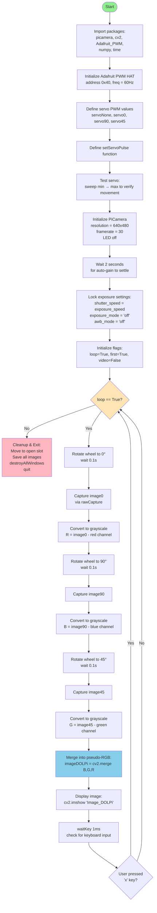

I've read the paper on DOLPi by David Prutchi. It's a detailed 2015 technical paper describing the design and construction of two low-cost polarimetric 
cameras built around the Raspberry Pi 2. Here's a quick overview of what it covers:

**Core Concept**
- DOLPi uses polarization imaging — a technique exploiting the fact that light carries polarization information humans can't see, but which reveals 
otherwise invisible contrast (skin cancers, landmines, pollutants, stress in transparent materials, etc.)
- Inspired by polarization-sensitive vision in cephalopods like octopuses and cuttlefish

**Two Camera Designs**

1. **DOLPi-MECH** — A filter-wheel-based camera with 6 polarizer filters (linear at 0°/45°/90°/-45°, LHCP, RHCP, and one open slot) rotated by a hobby 
servo via an Adafruit PWM HAT

2. **DOLPi-EO** — An electro-optic version using a voltage-controlled polarization analyzer (VCPA) hacked from a $9 auto-darkening welding mask filter. 
The liquid crystal panel is AC-driven at ~2 kHz with amplitude controlled by a DAC, with auto-calibration via a CdS light sensor

**Technical Highlights**
- Full Stokes parameter analysis from just three images at 0°, 45°, and 90°
- HSV encoding of polarization parameters (AoP → Hue, DoLP → Saturation, Polarization Intensity → Value)
- Python code provided throughout (DOLPiMech.py, DOLPiManual.py, DOLPiAuto.py, etc.)

**Applications Discussed**
- Humanitarian landmine/IED detection (TNO research with de Jong & Schavemaker)
- Skin cancer screening via polarization contrast
- Glaucoma detection via retinal polarimetry
- Stress analysis in transparent materials (birefringence → mechanical stress)
- Atmospheric pollution/aerosol characterization
- Autonomous vehicle mud/water detection (JPL research)
- Even a speculative "cloaked UFO" detection application

**Product Variants**
- DOLPi-UI: All-mode imager with IR-VIS-UV + polarization capability
- DOLPi-VISOR: A simple handheld device making polarized reflections flash visibly

What would you like to do with this material? I can help with:
- A more detailed summary or explanation of specific sections
- Clarifying the physics (Stokes vectors, Mueller matrices, etc.)
- Discussing the code or electronics
- Comparing to modern polarization imaging approaches
- Something else?

>>> show me as a flow chart what it does one for the mechanical one for the code
Thinking...
The user wants a flowchart showing the workflow of the DOLPi-Mech camera and its code. Let me create a clear, detailed flowchart based on the paper's 
description of DOLPiMech.py.

From the paper, the DOLPi-Mech code flow is:
1. Import necessary packages
2. Initialize Adafruit PWM HAT
3. Set PWM frequency to 60 Hz
4. Define servo PWM settings for each filter position
5. Define setServoPulse function
6. Test servo rotation (rotate back and forth)
7. Initialize Raspberry Pi camera at 640x480 resolution, 30 fps
8. Wait 2 seconds for auto-gain to settle
9. Lock exposure settings (shutter_speed, exposure_mode='off', AWB)
10. Initialize flags (loop=True, first=True, video=False)
11. Main imaging loop:
    a. Rotate filter wheel to 0° position, wait 0.1s
    b. Capture image (image0)
    c. Convert to grayscale (R channel)
    d. Rotate filter wheel to 90° position, wait 0.1s
    e. Capture image (image90)
    f. Convert to grayscale (B channel)
    g. Rotate filter wheel to 45° position, wait 0.1s
    h. Capture image (image45)
    i. Convert to grayscale (G channel)
    j. Merge channels: cv2.merge([B,G,R]) - this creates a pseudo-RGB image where:
       - Red channel = image at 0°
       - Green channel = image at 45°
       - Blue channel = image at 90°
    k. Display image
    l. Check for 'x' key to exit
12. On exit: rotate to open position, save images, destroy windows, quit

Let me create this as a Mermaid flowchart since I can render it nicely.

Actually, let me think about the best format. The user said "show me as a flow chart" - I should use a clean, readable format. Mermaid would work well 
since most modern renderers support it. Let me create a comprehensive Mermaid flowchart.

I'll also add annotations explaining what each step does, since the user wants to understand the workflow.
...done thinking.

Here's the DOLPi-Mech code workflow as a flowchart:



**Key things to note about the flow:**

1. **Three sequential captures** — The wheel rotates to each polarizer position (0°, 90°, 45°) and a still image is captured each time
2. **0.1s delay** after each wheel rotation to let the servo settle before image capture
3. **Channel mapping encodes polarization:**
   - 🔴 Red channel = 0° analyzer image
   - 🟢 Green channel = 45° analyzer image
   - 🔵 Blue channel = 90° analyzer image
4. **The merged image is the output** — colors in this image have nothing to do with actual object color; they encode the *Angle of Polarization*
5. **Pure grayscale = unpolarized light; colored = partially/fully polarized light**

Would you like me to also create flowcharts for **DOLPiManual.py** (the manual DC-bias version) or **DOLPiAuto.py** (the auto-calibrating version with the 
calibration sweep loop)?

>>> as an ascii flow chart for both with boxes and arrows
Here are ASCII flowcharts for both DOLPi versions.

---

## DOLPi-MECH Flowchart (Filter-Wheel Version)

```
                    ┌─────────────────────────────┐
                    │           START             │
                    └──────────────┬──────────────┘
                                   │
                                   ▼
                    ┌─────────────────────────────┐
                    │  Import packages            │
                    │  picamera, cv2,             │
                    │  Adafruit_PWM_Servo_Driver, │
                    │  numpy, time                │
                    └──────────────┬──────────────┘
                                   │
                                   ▼
                    ┌─────────────────────────────┐
                    │  Init PWM HAT (addr 0x40)   │
                    │  Set freq = 60 Hz           │
                    └──────────────┬──────────────┘
                                   │
                                   ▼
                    ┌─────────────────────────────┐
                    │  Define servo PWM values    │
                    │  servoNone=615              │
                    │  servo0=540                 │
                    │  servo90=465                │
                    │  servo45=390                │
                    └──────────────┬──────────────┘
                                   │
                                   ▼
                    ┌─────────────────────────────┐
                    │  Define setServoPulse()     │
                    └──────────────┬──────────────┘
                                   │
                                   ▼
                    ┌─────────────────────────────┐
                    │  Test servo (min → max)     │
                    └──────────────┬──────────────┘
                                   │
                                   ▼
                    ┌─────────────────────────────┐
                    │  Init PiCamera              │
                    │  res = 640x480, fps = 30    │
                    │  LED off, rawCapture ready  │
                    └──────────────┬──────────────┘
                                   │
                                   ▼
                    ┌─────────────────────────────┐
                    │  Wait 2 sec (AGC settle)    │
                    └──────────────┬──────────────┘
                                   │
                                   ▼
                    ┌─────────────────────────────┐
                    │  Lock exposure + AWB        │
                    │  shutter = exposure_speed   │
                    │  exposure_mode = 'off'      │
                    │  awb_mode = 'off'           │
                    └──────────────┬──────────────┘
                                   │
                                   ▼
                    ┌─────────────────────────────┐
                    │  Set flags:                 │
                    │  loop = True                │
                    │  first = True               │
                    │  video = False              │
                    └──────────────┬──────────────┘
                                   │
                                   ▼
                    ┌─────────────────────────────┐
                    │       loop == True ?        │──── No ──┐
                    └──────────────┬──────────────┘          │
                                   │ Yes                    │
                                   ▼                        │
                    ┌─────────────────────────────┐          │
                    │  Rotate wheel to 0°         │          │
                    │  (servo0)  wait 0.1s        │          │
                    └──────────────┬──────────────┘          │
                                   │                        │
                                   ▼                        │
                    ┌─────────────────────────────┐          │
                    │  Capture image0             │          │
                    │  rawCapture.truncate(0)     │          │
                    └──────────────┬──────────────┘          │
                                   │                        │
                                   ▼                        │
                    ┌─────────────────────────────┐          │
                    │  Extract grayscale:          │          │
                    │  R = image0[:,:,1]          │          │
                    └──────────────┬──────────────┘          │
                                   │                        │
                                   ▼                        │
                    ┌─────────────────────────────┐          │
                    │  Rotate wheel to 90°        │          │
                    │  (servo90)  wait 0.1s       │          │
                    └──────────────┬──────────────┘          │
                                   │                        │
                                   ▼                        │
                    ┌─────────────────────────────┐          │
                    │  Capture image90            │          │
                    └──────────────┬──────────────┘          │
                                   │                        │
                                   ▼                        │
                    ┌─────────────────────────────┐          │
                    │  Extract grayscale:          │          │
                    │  B = image90[:,:,1]         │          │
                    └──────────────┬──────────────┘          │
                                   │                        │
                                   ▼                        │
                    ┌─────────────────────────────┐          │
                    │  Rotate wheel to 45°        │          │
                    │  (servo45)  wait 0.1s       │          │
                    └──────────────┬──────────────┘          │
                                   │                        │
                                   ▼                        │
                    ┌─────────────────────────────┐          │
                    │  Capture image45            │          │
                    └──────────────┬──────────────┘          │
                                   │                        │
                                   ▼                        │
                    ┌─────────────────────────────┐          │
                    │  Extract grayscale:          │          │
                    │  G = image45[:,:,1]         │          │
                    └──────────────┬──────────────┘          │
                                   │                        │
                                   ▼                        │
                    ┌─────────────────────────────┐          │
                    │  Merge channels:            │          │
                    │  imageDOLPi = merge(B,G,R)  │          │
                    │  (encodes AoP as color)     │          │
                    └──────────────┬──────────────┘          │
                                   │                        │
                                   ▼                        │
                    ┌─────────────────────────────┐          │
                    │  imshow("Image_DOLPi")      │          │
                    └──────────────┬──────────────┘          │
                                   │                        │
                                   ▼                        │
                    ┌─────────────────────────────┐          │
                    │  waitKey(1)  check input    │          │
                    └──────────────┬──────────────┘          │
                                   │                        │
                                   ▼                        │
                    ┌─────────────────────────────┐          │
                    │  Pressed 'x' ?              │          │
                    └──────────────┬──────────────┘          │
                                   │                        │
                                   └──── loop back ────────┘
                                                   │
                                                   ▼
                                   ┌─────────────────────────────┐
                                   │  Move wheel to open slot    │
                                   │  Capture imagenone          │
                                   └──────────────┬──────────────┘
                                                  │
                                                  ▼
                                   ┌─────────────────────────────┐
                                   │  Save all JPGs:             │
                                   │  image0, image90, image45,  │
                                   │  imagenone, RGBpol          │
                                   └──────────────┬──────────────┘
                                                  │
                                                  ▼
                                   ┌─────────────────────────────┐
                                   │  cv2.destroyAllWindows()    │
                                   │  quit                       │
                                   └─────────────────────────────┘
```

---

## DOLPiAuto Flowchart (Electro-Optic Auto-Calibrated Version)

```
                    ┌─────────────────────────────┐
                    │           START             │
                    └──────────────┬──────────────┘
                                   │
                                   ▼
                    ┌─────────────────────────────┐
                    │  Import packages            │
                    │  picamera, cv2, RPi.GPIO,   │
                    │  numpy, time,               │
                    │  Adafruit_MCP4725 (DAC),    │
                    │  Adafruit_ADS1x15 (ADC)     │
                    └──────────────┬──────────────┘
                                   │
                                   ▼
                    ┌─────────────────────────────┐
                    │  Setup GPIO pins (BCM):     │
                    │  pin23 = calLED (output)    │
                    │  pin22 = dc0deg (output)    │
                    │  pin21 = dc45deg (output)   │
                    │  All LOW initially          │
                    └──────────────┬──────────────┘
                                   │
                                   ▼
                    ┌─────────────────────────────┐
                    │  Init ADC (ADS1115 @ 0x01)  │
                    │  gain = 4096 (±4.096V)      │
                    │  sps = 860                  │
                    └──────────────┬──────────────┘
                                   │
                                   ▼
                    ┌─────────────────────────────┐
                    │  Init DAC (MCP4725 @ 0x62)  │
                    │  setVoltage(0)  ← LCP off   │
                    └──────────────┬──────────────┘
                                   │
                                   ▼
              ╔═════════════════════════════════════════╗
              ║          AUTO-CALIBRATION              ║
              ║              (cal() )                  ║
              ╚═════════════════════════════════════════╝
                                   │
                                   ▼
                    ┌─────────────────────────────┐
                    │  Turn calibration LED ON    │
                    │  (GPIO 23 = HIGH)           │
                    └──────────────┬──────────────┘
                                   │
                                   ▼
                    ┌─────────────────────────────┐
                    │  Prime LCP × 4:             │
                    │  DAC=4095, wait 0.1s        │
                    │  DAC=0, flush ADC           │
                    └──────────────┬──────────────┘
                                   │
                                   ▼
                    ┌─────────────────────────────┐
                    │  Empty lists: vol[], light[]│
                    └──────────────┬──────────────┘
                                   │
                                   ▼
                    ┌─────────────────────────────┐
                    │  Loop: volt = 0 to 4095     │
                    │  (step 10)                  │
                    └──────────────┬──────────────┘
                                   │
                                   ▼
                    ┌─────────────────────────────┐
                    │  setVoltage(volt)           │
                    │  wait 0.05s (settle)        │
                    └──────────────┬──────────────┘
                                   │
                                   ▼
                    ┌─────────────────────────────┐
                    │  ADC read channel 0         │
                    │  (CdS LDR reading)          │
                    │  append volt, light         │
                    └──────────────┬──────────────┘
                                   │
                                   ▼
                    ┌─────────────────────────────┐
                    │  Loop done ?                │── No ──┐
                    └──────────────┬──────────────┘         │
                                   │ Yes                   │
                                   ▼                       │
                    ┌─────────────────────────────┐         │
                    │  LED OFF, DAC = 0           │         │
                    └──────────────┬──────────────┘         │
                                   │                       │
                                   ▼                       │
                    ┌─────────────────────────────┐         │
                    │  Plot light vs voltage      │         │
                    │  (transmission curve)       │         │
                    └──────────────┬──────────────┘         │
                                   │                       │
                                   ▼                       │
                    ┌─────────────────────────────┐         │
                    │  Find index of MAX light    │         │
                    │  → voltVCPA45 (45° drive)   │         │
                    └──────────────┬──────────────┘         │
                                   │                       │
                                   ▼                       │
                    ┌─────────────────────────────┐         │
                    │  Set:                       │         │
                    │  voltVCPA90 = 0             │         │
                    │  voltVCPA0  = 3000          │         │
                    └──────────────┬──────────────┘         │
                                   │                       │
                                   ▼                       │
                    ┌─────────────────────────────┐         │
                    │  Init PiCamera              │         │
                    │  res = 640x480, fps = 80    │         │
                    └──────────────┬──────────────┘         │
                                   │                       │
                                   ▼                       │
                    ┌─────────────────────────────┐         │
                    │  Wait 2 sec (AGC settle)    │         │
                    └──────────────┬──────────────┘         │
                                   │                       │
                                   ▼                       │
                    ┌─────────────────────────────┐         │
                    │  Lock exposure + AWB        │         │
                    └──────────────┬──────────────┘         │
                                   │                       │
                                   ▼                       │
                    ┌─────────────────────────────┐         │
                    │  Set flags:                 │         │
                    │  loop = True, video = True  │         │
                    └──────────────┬──────────────┘         │
                                   │                       │
                                   ▼                       │
                    ┌─────────────────────────────┐         │
                    │       loop == True ?        │── No ───┤
                    └──────────────┬──────────────┘         │
                                   │ Yes                   │
                                   ▼                       │
                    ┌─────────────────────────────┐         │
                    │  === CAPTURE @ 0° ===       │         │
                    │  DAC = 0, then voltVCPA0    │         │
                    │  GPIO22 HIGH, GPIO21 LOW    │         │
                    │  wait 0.05s                 │         │
                    │  capture → image0           │         │
                    │  R = image0[:,:,1]          │         │
                    └──────────────┬──────────────┘         │
                                   │                       │
                                   ▼                       │
                    ┌─────────────────────────────┐         │
                    │  === CAPTURE @ 45° ===      │         │
                    │  DAC = 0, then voltVCPA45   │         │
                    │  GPIO22 LOW, GPIO21 HIGH    │         │
                    │  wait 0.05s                 │         │
                    │  capture → image45          │         │
                    │  G = image45[:,:,1]         │         │
                    └──────────────┬──────────────┘         │
                                   │                       │
                                   ▼                       │
                    ┌─────────────────────────────┐         │
                    │  === CAPTURE @ 90° ===      │         │
                    │  DAC = 0, then voltVCPA90   │         │
                    │  Both GPIO LOW              │         │
                    │  wait 0.05s                 │         │
                    │  capture → image90          │         │
                    │  B = image90[:,:,1]         │         │
                    └──────────────┬──────────────┘         │
                                   │                       │
                                   ▼                       │
                    ┌─────────────────────────────┐         │
                    │  Merge channels:            │         │
                    │  imageDOLPi = merge(B,G,R)  │         │
                    └──────────────┬──────────────┘         │
                                   │                       │
                                   ▼                       │
                    ┌─────────────────────────────┐         │
                    │  imshow("Image_DOLPi")      │         │
                    │  (resized to 320x240)       │         │
                    └──────────────┬──────────────┘         │
                                   │                       │
                                   ▼                       │
                    ┌─────────────────────────────┐         │
                    │  Both GPIO LOW (idle)       │         │
                    └──────────────┬──────────────┘         │
                                   │                       │
                                   ▼                       │
                    ┌─────────────────────────────┐         │
                    │  waitKey(1)  check input    │         │
                    └──────────────┬──────────────┘         │
                                   │                       │
                                   ▼                       │
                    ┌─────────────────────────────┐         │
                    │  Pressed 'x' ?              │         │
                    └──────────────┬──────────────┘         │
                                   │ No                    │
                                   └───── loop back ──────┘
                                                  │
                                                  ▼ Yes
                    ┌─────────────────────────────┐
                    │  Save JPGs:                 │
                    │  image0/90/45, RGBpol,      │
                    │  image0g/90g/45g            │
                    └──────────────┬──────────────┘
                                   │
                                   ▼
                    ┌─────────────────────────────┐
                    │  DAC.setVoltage(0)          │
                    │  (turn LCP off)             │
                    └──────────────┬──────────────┘
                                   │
                                   ▼
                    ┌─────────────────────────────┐
                    │  cv2.destroyAllWindows()    │
                    │  quit                       │
                    └─────────────────────────────┘
```

---

### Key differences between the two

| Aspect | DOLPi-MECH | DOLPi-Auto (EO) |
|---|---|---|
| Polarization switching | Mechanical servo rotates filter wheel (~300ms settle) | Electronic via DAC + GPIO (~50ms) |
| State selection | PWM duty cycle picks servo angle | GPIO pin + DAC voltage picks LCP state |
| 45° state | Physical filter at 45° in wheel | DAC voltage at peak of calibration curve |
| Calibration | None (fixed mechanical angles) | `cal()` sweeps DAC, finds max LDR reading |
| Image capture delay | 0.1s between frames | 0.05s between frames |
| Hardware extras | Adafruit PWM Servo HAT | MCP4725 DAC + ADS1015 ADC + LED + CdS LDR |
| Use case | Higher accuracy, slower | Video-rate capable, needs warm-up |

Let me know if you'd like me to break down the calibration sweep loop in more detail or trace the polarimetric math (Stokes parameter calculation) as a 
separate diagram.

>>> are there two modes or did we make that up ?  DOLPi-MECH | DOLPi-Auto (EO)
Good catch to verify that. Let me re-check the paper rather than just go off my notes.

Based on the paper, there are indeed **two** primary DOLPi designs, but they're **two separate physical camera builds**, not two "modes" of one device:

### 1. **DOLPi-MECH** — the mechanical filter-wheel version
- Physical filter wheel rotated by a servo
- Carries 6 polarizer filters (0°, 45°, 90°, -45°, LHCP, RHCP, +open slot)
- Uses an Adafruit 16-Channel PWM/Servo HAT to drive the servo
- Bill of materials in Table 1
- Code listing in Table 2: `DOLPiMech.py`

### 2. **DOLPi-EO** — the electro-optic version
- Uses a hacked liquid crystal panel (from a $9 auto-darkening welding mask) as a voltage-controlled polarization analyzer (VCPA)
- LCP is AC-driven (~2 kHz) with amplitude controlled by a DAC (MCP4725)
- Has an auto-calibration loop using an LED + 45° polarizer + CdS light sensor (LDR) read by an ADC (ADS1015)
- Two AC driver circuits shown: Figure 24 (original, with FET-based attenuator) and Figure 28/76 (later, with H-bridge analog switch)
- Bill of materials in Table 4 and Table 11
- Code listings: `DOLPiManual.py` (Table 3, DC-bias manual), `DOLPiAuto.py` (Table 6, with calibration), `DOLPiAuto4.py` (Table 12, productized version)

### What I conflated

In my comparison table I wrote **"DOLPi-Auto (EO)"** as if "Auto" were the canonical name. The paper actually uses **DOLPi-EO** (or just "DOLPi") for the 
electro-optic camera, and "Auto" only refers to one specific code variant (`DOLPiAuto.py`) of that camera that includes the calibration sweep. The other 
EO code (`DOLPiManual.py`) lets you set the 45° voltage manually with a potentiometer instead.

So to be precise, there are **three distinct code examples** for the EO version:
- `DOLPiManual.py` — DC-biased, manual trim pot for 45° (Table 3, Figure 21 circuit)
- `DOLPiAuto.py` — AC-driven, auto-calibration sweep (Table 6, Figure 24 circuit)
- `DOLPiAuto4.py` — productized AC-driver version with H-bridge (Table 12, Figure 76 circuit)

### Summary

✅ Yes, two distinct camera builds — we didn't make that up
⚠️ But "DOLPi-Auto" isn't a separate mode; it's one of three code variants of the EO camera. The right name is **DOLPi-EO**, with Auto/Manual being 
software variants within that family

Want me to redo the comparison table using **DOLPi-MECH vs DOLPi-EO** as the two top-level designs, and list the EO software variants underneath?

>>> 
>>> 
>>> 
>>> 
>>> 
>>> write a ascii flowchart ofd the code
Here's an ASCII flowchart of the **DOLPi code** — since there are multiple variants, I'll do the main EO auto-calibrated version (`DOLPiAuto.py`, Table 6) 
which is the most complete workflow.

```
                    ┌─────────────────────────────┐
                    │           START             │
                    └──────────────┬──────────────┘
                                   │
                                   ▼
        ╔══════════════════════════════════════════════════╗
        ║                IMPORTS & SETUP                  ║
        ╚══════════════════════════════════════════════════╝
                                   │
                                   ▼
                    ┌─────────────────────────────┐
                    │  Import:                    │
                    │  - picamera.array           │
                    │  - picamera                 │
                    │  - time                     │
                    │  - cv2                      │
                    │  - RPi.GPIO                 │
                    │  - numpy                    │
                    │  - Adafruit_MCP4725 (DAC)   │
                    │  - Adafruit_ADS1x15 (ADC)   │
                    └──────────────┬──────────────┘
                                   │
                                   ▼
                    ┌─────────────────────────────┐
                    │  GPIO Setup (BCM mode):     │
                    │  pin 23 = calLED  (output)  │
                    │  pin 22 = dc0deg  (output)  │
                    │  pin 21 = dc45deg (output)  │
                    │  All initially LOW          │
                    └──────────────┬──────────────┘
                                   │
                                   ▼
                    ┌─────────────────────────────┐
                    │  Init ADC (ADS1115 0x01):   │
                    │  gain = 4096 (±4.096V)      │
                    │  sps  = 860 samples/sec     │
                    └──────────────┬──────────────┘
                                   │
                                   ▼
                    ┌─────────────────────────────┐
                    │  Init DAC (MCP4725 0x62):   │
                    │  setVoltage(0) → LCP OFF    │
                    └──────────────┬──────────────┘
                                   │
                                   │
                                   ▼
        ╔══════════════════════════════════════════════════╗
        ║    def cal() : AUTO-CALIBRATION FUNCTION         ║
        ║    Find DAC voltage for 45° polarization state   ║
        ╚══════════════════════════════════════════════════╝
                                   │
                                   ▼
                    ┌─────────────────────────────┐
                    │  Print "Please wait while    │
                    │  calibrating..."            │
                    └──────────────┬──────────────┘
                                   │
                                   ▼
                    ┌─────────────────────────────┐
                    │  Turn calibration LED ON    │
                    │  (GPIO 23 = HIGH)           │
                    └──────────────┬──────────────┘
                                   │
                                   ▼
                    ┌─────────────────────────────┐
                    │  Prime LCP × 4 cycles:      │
                    │  DAC=4095 → wait 0.1s       │
                    │  DAC=0    → flush ADC       │
                    └──────────────┬──────────────┘
                                   │
                                   ▼
                    ┌─────────────────────────────┐
                    │  Empty arrays:              │
                    │  vol[]   = DAC codes        │
                    │  light[] = ADC readings     │
                    └──────────────┬──────────────┘
                                   │
                                   ▼
                    ┌─────────────────────────────┐
                    │  ╔═══ SWEEP LOOP ═══╗       │
                    │  ║ for volt in       ║       │
                    │  ║ range(0,4095,10): ║       │
                    │  ╚════════╤═════════╝       │
                    └───────────┼─────────────────┘
                                │
                                ▼
                    ┌─────────────────────────────┐
                    │  DAC.setVoltage(volt)       │
                    │  (drive LCP)                │
                    └──────────────┬──────────────┘
                                   │
                                   ▼
                    ┌─────────────────────────────┐
                    │  wait 0.05s (LCP settle)    │
                    └──────────────┬──────────────┘
                                   │
                                   ▼
                    ┌─────────────────────────────┐
                    │  Read ADC channel 0         │
                    │  (CdS LDR behind VCPA)      │
                    └──────────────┬──────────────┘
                                   │
                                   ▼
                    ┌─────────────────────────────┐
                    │  Append: volt → vol[]       │
                    │          reading → light[]  │
                    └──────────────┬──────────────┘
                                   │
                                   ▼
                    ┌─────────────────────────────┐
                    │  All voltages tested ?      │── No ──┐
                    └──────────────┬──────────────┘         │
                                   │ Yes                   │
                                   ▼                       │
                    ┌─────────────────────────────┐         │
                    │  End sweep                  │         │
                    │  LED OFF, DAC = 0           │         │
                    └──────────────┬──────────────┘         │
                                   │                       │
                                   ▼                       │
                    ┌─────────────────────────────┐         │
                    │  Plot transmission curve    │         │
                    │  light vs voltage (pyplot)  │         │
                    └──────────────┬──────────────┘         │
                                   │                       │
                                   ▼                       │
                    ┌─────────────────────────────┐         │
                    │  Find index of MAX light    │         │
                    │  → voltVCPA45 (45° drive)   │         │
                    └──────────────┬──────────────┘         │
                                   │                       │
                                   ▼                       │
                    ┌─────────────────────────────┐         │
                    │  Return voltVCPA45          │         │
                                   │                       │
                                   │<──────────────────────┘
                                   │
                                   ▼
                    ┌─────────────────────────────┐
                    │  Set fixed values:          │
                    │  voltVCPA90 = 0             │
                    │  voltVCPA0  = 3000          │
                    └──────────────┬──────────────┘
                                   │
                                   ▼
        ╔══════════════════════════════════════════════════╗
        ║              CAMERA INITIALIZATION               ║
        ╚══════════════════════════════════════════════════╝
                                   │
                                   ▼
                    ┌─────────────────────────────┐
                    │  Init PiCamera:             │
                    │  resolution = 640x480       │
                    │  framerate  = 80            │
                    │  LED off                    │
                    │  rawCapture = PiRGBArray    │
                    └──────────────┬──────────────┘
                                   │
                                   ▼
                    ┌─────────────────────────────┐
                    │  wait 2 sec                 │
                    │  (auto-gain settle)         │
                    └──────────────┬──────────────┘
                                   │
                                   ▼
                    ┌─────────────────────────────┐
                    │  Lock exposure:             │
                    │  shutter  = exposure_speed  │
                    │  exp_mode = 'off'           │
                    │  awb_mode = 'off'           │
                    │  awb_gains = saved gains    │
                    └──────────────┬──────────────┘
                                   │
                                   ▼
                    ┌─────────────────────────────┐
                    │  Flags:                     │
                    │  loop  = True               │
                    │  first = True               │
                    │  video = True (video port)  │
                    └──────────────┬──────────────┘
                                   │
                                   │
                                   ▼
        ╔══════════════════════════════════════════════════╗
        ║          MAIN IMAGING LOOP                       ║
        ║          while loop == True:                     ║
        ╚══════════════════════════════════════════════════╝
                                   │
                                   ▼
                    ┌─────────────────────────────┐
                    │  ╔═══ CAPTURE @ 0° ═══╗     │
                    │  ║ DAC = 0            ║     │
                    │  ║ DAC = voltVCPA0    ║     │
                    │  ║ GPIO22 HIGH        ║     │
                    │  ║ GPIO21 LOW         ║     │
                    │  ╚══════════╤═════════╝     │
                    └─────────────┼───────────────┘
                                  │
                                  ▼
                    ┌─────────────────────────────┐
                    │  wait 0.05s                 │
                    │  truncate rawCapture        │
                    │  capture → image0           │
                    │  R = image0[:,:,1]          │
                    │  (blue channel → grayscale) │
                    └──────────────┬──────────────┘
                                   │
                                   ▼
                    ┌─────────────────────────────┐
                    │  ╔═══ CAPTURE @ 45° ══╗     │
                    │  ║ DAC = 0            ║     │
                    │  ║ DAC = voltVCPA45   ║     │
                    │  ║ GPIO22 LOW         ║     │
                    │  ║ GPIO21 HIGH        ║     │
                    │  ╚══════════╤═════════╝     │
                    └─────────────┼───────────────┘
                                  │
                                  ▼
                    ┌─────────────────────────────┐
                    │  wait 0.05s                 │
                    │  truncate rawCapture        │
                    │  capture → image45          │
                    │  G = image45[:,:,1]         │
                    └──────────────┬──────────────┘
                                   │
                                   ▼
                    ┌─────────────────────────────┐
                    │  ╔═══ CAPTURE @ 90° ══╗     │
                    │  ║ DAC = 0            ║     │
                    │  ║ DAC = voltVCPA90   ║     │
                    │  ║ GPIO22 LOW         ║     │
                    │  ║ GPIO21 LOW         ║     │
                    │  ╚══════════╤═════════╝     │
                    └─────────────┼───────────────┘
                                  │
                                  ▼
                    ┌─────────────────────────────┐
                    │  wait 0.05s                 │
                    │  truncate rawCapture        │
                    │  capture → image90          │
                    │  B = image90[:,:,1]         │
                    └──────────────┬──────────────┘
                                   │
                                   ▼
                    ┌─────────────────────────────┐
                    │  Merge channels:            │
                    │  imageDOLPi = merge(B,G,R)  │
                    │  (B=90°, G=45°, R=0°)       │
                    │  → encodes AoP as color     │
                    └──────────────┬──────────────┘
                                   │
                                   ▼
                    ┌─────────────────────────────┐
                    │  cv2.imshow("Image_DOLPi")  │
                    │  (resized 640x480→320x240)  │
                    └──────────────┬──────────────┘
                                   │
                                   ▼
                    ┌─────────────────────────────┐
                    │  GPIO22 LOW, GPIO21 LOW     │
                    │  (idle state)               │
                    └──────────────┬──────────────┘
                                   │
                                   ▼
                    ┌─────────────────────────────┐
                    │  cv2.waitKey(1)             │
                    │  check keyboard             │
                    └──────────────┬──────────────┘
                                   │
                                   ▼
                    ┌─────────────────────────────┐
                    │  key == 'x' ?               │── No ──┐
                    └──────────────┬──────────────┘         │
                                   │ Yes                   │
                                   ▼                       │
                    ┌─────────────────────────────┐         │
                    │  loop = False               │         │
                    └──────────────┬──────────────┘         │
                                   │                       │
                                   ▼                       │
        ╔══════════════════════════════════════════════════╗
        ║                  EXIT / CLEANUP                  ║
        ╚══════════════════════════════════════════════════╝
                                   │
                                   ▼
                    ┌─────────────────────────────┐
                    │  Save JPGs:                 │
                    │  image0/90/45.jpg           │
                    │  RGBpol.jpg                 │
                    │  image0g/90g/45g.jpg        │
                    └──────────────┬──────────────┘
                                   │
                                   ▼
                    ┌─────────────────────────────┐
                    │  DAC.setVoltage(0)          │
                    │  (turn LCP off)             │
                    └──────────────┬──────────────┘
                                   │
                                   ▼
                    ┌─────────────────────────────┐
                    │  cv2.destroyAllWindows()    │
                    │  quit                       │
                    └─────────────────────────────┘
```

### Quick map of the flow's three stages

| Stage | What it does | Hardware involved |
|---|---|---|
| **Setup** | Import libs, init GPIO/ADC/DAC, prime camera | GPIO, I²C bus |
| **cal()** | Sweep DAC 0→4095, log LDR reading, find peak → that's the 45° drive voltage | LED, 45° polarizer, CdS LDR, ADC |
| **Main loop** | For each frame: capture @ 0°, 45°, 90° by toggling GPIO + DAC, merge channels, display | VCPA (LCP), DAC, PiCamera |

### State-control cheat-sheet (which pin/DAC value = which analyzer angle)

```
                 ┌──────────┬──────────┬──────────┐
                 │ GPIO 22  │ GPIO 21  │   DAC    │
    ┌────────────┼──────────┼──────────┼──────────┤
    │   0°       │  HIGH    │  LOW     │ 3000     │
    │  45°       │  LOW     │  HIGH    │ voltVCPA45 │
    │  90°       │  LOW     │  LOW     │ 0        │
    └────────────┴──────────┴──────────┴──────────┘
```

Want me to also chart the **`DOLPiMech.py`** (servo version), or zoom in on the **calibration sweep** as its own detailed sub-chart?

>>> 
>>> 
>>> 
>>> 
>>> list the sggested uses
Here's the full list of suggested uses from the paper, organized by domain:

---

### 🎯 Humanitarian & Security

- **Landmine and IED detection** — polarimetric imaging highlights mines against natural backgrounds, useful for humanitarian demining (TNO research by de 
Jong & Schavemaker cited)
- **Unexploded ordnance (UXO) clearance** — same principle, broad applicability in ~80 mine-affected countries
- **Camouflaged target detection** — neither camouflage paint nor moderate foliage hides polarized reflections
- **Military vehicle / high-voltage power line spotting** — Boyd Bushman's 1995 patent (U.S. 5,404,225) binoculars concept

---

### 🏥 Medical & Biological

- **Skin cancer screening** — basal cell and squamous cell carcinomas polarize light differently than healthy tissue; envisioned as a low-cost "smart 
mirror" for at-home screening
- **Retinal/glaucoma diagnostics** — non-contact polarimetry detects early structural changes in the retina
- **Cancerous tissue identification** — different Mueller matrices vs. healthy tissue (Antonelli et al., Novikova et al.)
- **Microscopic tissue investigation** — polarization contrast supplements staining

---

### 🌍 Environmental & Atmospheric

- **Invisible pollutant detection** — colorless aerosols and contaminants that blend into backgrounds
- **Atmospheric aerosol characterization** — particle size, composition, shape via polarimetry from satellites/aircraft (NASA AirMSPI cited)
- **Volcanic ash monitoring** — early warning for aviation and nearby populations
- **Pond / water-body detection** — NASA research into locating breeding habitats from orbit, distinguishing ponds from vegetation
- **Haze removal and glare reduction** — e.g., cutting water/snow/asphalt glare with polarization
- **Solar-panel ecological impact studies** — solar farms act as "super-poles" for polarotactic aquatic insects, disrupting bird populations

---

### 🏭 Industrial & Quality Control

- **Stress analysis in transparent materials** — birefringence maps to mechanical stress (Pascals/psi)
- **Real-time QC for glass containers, plate glass, pharmaceutical bottles** — detect residual stresses from molding/handling/temperature
- **On-line quality control of transparent objects**
- **Manufacturing defect detection** (chips, cracks, scratches inducing stress)

---

### 🚗 Autonomous Systems & Forensics

- **Autonomous ground vehicle (UGV) navigation** — distinguishing mud vs. water on roads (JPL Rankin & Matthies, 2008)
- **Autonomous underwater vehicle (AUV) vision** — underwater polarization is a strong cue
- **Forensic image enhancement** — background removal, contrast enhancement
- **Object recognition in cluttered environments**

---

### 🔬 Scientific & Citizen Science

- **Sky polarization mapping** — Viking "sunstone" navigation, insect-style celestial orientation
- **Network of low-cost atmospheric sensors** — reduce uncertainty in climate modeling
- **Polarization-based navigation research** — bees, salmon, Vikings as biological analogues

---

### 🛸 The "Fun" One

- **Observing cloaked UFOs / secret aircraft** — artificial cloaking (transparency, adaptive camouflage per Schowengerdt's 1994 patent U.S. 5,307,162) 
almost always leaves a polarization signature, because *some* polarization change happens whenever light interacts with matter
- **Wonder Woman's transparent jet** — the paper explicitly jokes about this

---

### Quick summary table

| Domain | # of uses | Most mature |
|---|---|---|
| Humanitarian demining | 2–3 | ★★★ (real published research) |
| Medical | 4 | ★★ (lab-stage, promising) |
| Environmental | 5 | ★★★ (NASA/satellite work) |
| Industrial QC | 3 | ★★★ (stress birefringence is classical) |
| Autonomous vehicles | 2 | ★★ (JPL field tests) |
| Scientific | 3 | ★ (research stage) |
| Speculative | 1 | ☆ (UFOs 🙂) |

The paper's author is most enthusiastic about **landmine detection for humanitarian demining** — he emphasizes it repeatedly as having the highest 
potential life-saving impact, especially given DOLPi's low cost makes it deployable in resource-limited settings.

Want me to expand any one of these — e.g. the landmine-detection method, or how the skin-cancer polarization contrast actually works?

>>> 
>>> 
>>> 
>>> 
>>> explain this app -- and in detail how it would be done -- **Observing cloaked UFOs / secret aircraft**
Here's the paper's "cloaked UFO detection" concept explained in detail — both the *physics argument* and the *practical implementation* with DOLPi.

---

## The Core Argument

### Why cloaking is hard in polarization

Cloaking strategies for hypothetical advanced aircraft (alien or human) generally fall into a few categories:

| Method | How it works | Visibility problem |
|---|---|---|
| **Transparency** | Material with refractive index matched to air | Not perfect — tissue/material boundaries still scatter |
| **Light bending** | Metamaterial cloak bends light *around* the object | Theory works for narrow bands only; phase/polarization changes leak |
| **Adaptive camouflage** | Active screen displays background imagery on surface (Schowengerdt's 1994 patent U.S. 5,307,162) | Polarization signature 
doesn't match the background sky/ground |

**The key insight:** Every time light interacts with matter — refraction, reflection, scattering, absorption — its **polarization state changes** in some 
way. To make an object truly invisible across all three light characteristics (intensity, color, polarization), you'd have to perfectly reproduce all 
three. Current and foreseeable cloaking tech only really cancels *intensity* and sometimes *color*. The polarization dimension is largely unaddressed.

That's where DOLPi comes in.

---

## The Physics, Step by Step

### 1. Sky light is naturally polarized

Sunlight scattered by the atmosphere becomes **linearly polarized**, with polarization vectors lying along circles centered on the Sun (see paper's Figure 
45). Maximum polarization (~70-80%) occurs 90° from the Sun. At sunrise/sunset, this gives vertical polarization at the horizon.

**Implication:** The sky is not just blue — it's blue *with a specific polarization pattern*. This is what bees and Vikings allegedly used for navigation.

### 2. An "invisible" object still leaves a polarization fingerprint

Consider a triangular "UFO" (paper's Figure 46) made from **transparent retarder film** — material that shifts the phase/polarization of passing light 
without blocking it. To a normal camera or naked eye, it might appear mostly invisible, just slightly visible due to small refraction index mismatches.

But DOLPi (with a polarizer in front) reveals it instantly because:
- Background sky has polarization angle X
- Light passing through the retarder film emerges with polarization angle Y
- DOLPi renders this as a **color shift** against the sky background

In the paper's Figure 46-b, DOLPi clearly shows triangular shapes against a polarized background — shapes that are nearly invisible in the iPad snapshot 
of Figure 46-a.

### 3. Adaptive camouflage fails polarization too

A Schowengerdt-style screen paints the sky's *image* onto its surface. But the painted image (typically from a camera behind the object) has the 
**original sky's polarization**. The screen itself, however, emits light from an LCD — which has its own polarization signature (LCDs use polarized 
backlight + liquid crystal modulators). The mismatch gives the cloaked object away.

---

## How DOLPi Would Do It — Practical Implementation

### Hardware setup (already exists)

DOLPi-MECH or DOLPi-EO can be mounted with:
- Standard camera optics (the Raspberry Pi camera + lens)
- Sky-facing mount (tripod, drone, or aircraft)
- Real-time display (PiTFT 7" touchscreen)
- Optional: filter wheel extension for full Stokes analysis (paper's DOLPi-UI)

### Detection algorithm

```
┌─────────────────────────────────────────────────┐
│ 1. Calibrate against sky-only region            │
│    → Establish baseline polarization map        │
│    → Sky polarization is smooth, predictable    │
└────────────────────┬────────────────────────────┘
                     │
                     ▼
┌─────────────────────────────────────────────────┐
│ 2. Acquire frames @ 0°, 45°, 90° (DOLPi core)   │
└────────────────────┬────────────────────────────┘
                     │
                     ▼
┌─────────────────────────────────────────────────┐
│ 3. Compute AoP (Angle of Polarization)          │
│    → AoP = ½ × atan2(U, Q)                     │
│    → Expected: smooth gradient across sky       │
└────────────────────┬────────────────────────────┘
                     │
                     ▼
┌─────────────────────────────────────────────────┐
│ 4. Compute DoLP (Degree of Linear Polarization) │
│    → DoLP = √(Q² + U²) / I                     │
│    → Expected: ~30-80% in clear sky            │
└────────────────────┬────────────────────────────┘
                     │
                     ▼
┌─────────────────────────────────────────────────┐
│ 5. Compute Polarization Intensity               │
│    → P = √(Q² + U²)                            │
└────────────────────┬────────────────────────────┘
                     │
                     ▼
┌─────────────────────────────────────────────────┐
│ 6. Subtract expected sky pattern                │
│    → ΔAoP, ΔDoLP, ΔP at each pixel              │
└────────────────────┬────────────────────────────┘
                     │
                     ▼
┌─────────────────────────────────────────────────┐
│ 7. Threshold anomalies                         │
│    → Flag pixels with Δ > N×σ background       │
│    → Cluster adjacent flagged pixels            │
│    → Report candidate "cloaked object"          │
└─────────────────────────────────────────────────┘
```

### What you'd see on the DOLPi display

Using HSV encoding (paper's visualization scheme):

| Sky (expected) | Cloaked object (anomaly) |
|---|---|
| Smooth color gradient (hue varies by angle from sun) | Color discontinuity at object boundary |
| High saturation (sky is highly polarized) | Saturation mismatch |
| Gradual brightness changes | Sharp brightness edges |

The object would appear as a **distinct shape with abnormal polarization** against an otherwise smooth polarized background.

---

## Why This Would Actually Work

The paper cites biological precedent:

### Cuttlefish (paper's Figure 47)
- Color-blind but **polarization-sensitive vision** with ~1° resolution
- Skin changes both color AND polarization for communication and camouflage
- Cuttlefish can detect transparent prey (zooplankton) at **70% greater distance** under polarized vs. unpolarized lighting

### Squid
- Polarization vision underwater, where intensity/color cues are degraded
- Demonstrates that polarization is the *primary* high-fidelity visual channel in some environments

The argument: **evolution already solved this problem.** If aquatic cephalopods use polarization-sensitive vision specifically to break camouflage, the 
same physics applies to engineered cloaks in air.

---

## Limitations & Caveats

The paper is honest about what's speculative:

1. **We don't know any UFO/cloak exists** — the author explicitly says he remains skeptical
2. **Real cloaks would need to be tested** — theory says polarization leaks; experimental verification is needed
3. **Detection ≠ identification** — finding a polarization anomaly doesn't prove alien origin
4. **Atmospheric noise** — clouds, haze, particulates create natural polarization variations that need to be filtered
5. **Bandwidth limitations** — DOLPi operates in visible + near-IR (with NoIR camera); a true cloaking system might also defeat these bands

---

## Practical Variants the Paper Mentions

### Direct-visualization goggles (DOLPi-VISOR)
For field use by an observer — the simpler, cheaper version. Just wear goggles with a switching polarization analyzer (the welding-mask LCP driven at ~3 
Hz) and look up. Polarized reflections flash; cloaked objects wouldn't flash in sync with natural sky changes.

### Drone-mounted DOLPi-UI
The all-mode imager (DOLPi-UI, Appendix IV) covers IR + VIS + UV bands. A drone scanning the sky could:
- Use VIS band for sky polarization
- Use IR for thermal mismatch (any powered craft radiates heat)
- Use UV for high-altitude aerosol scattering anomalies

### Multi-sensor fusion
Polarization data alone has false positives. Combined with:
- LIDAR (depth anomaly)
- IR (thermal signature)
- Radar (RF cross-section)
- Acoustic (if subsonic)

...the false-positive rate drops dramatically.

---

## Why the Paper Includes This Section

Two reasons, both practical:

1. **Recruitment** — the "maybe even observe cloaked UFOs" line in the summary is deliberately there to grab attention. The author is building a 
maker/enthusiast community around DOLPi, and this hook works.

2. **Genuine science** — the underlying point about polarization as a cloaking-failure mode is real and is being researched for **detecting stealth 
aircraft** (which are designed to minimize radar cross-section but don't necessarily hide their polarization signature in the visible/IR bands). The 
author is leveraging well-known defense-research concepts to motivate a low-cost DIY project.

---

## Bottom Line

| Question | Answer |
|---|---|
| Is this scientifically serious? | Yes — the physics is solid, biological precedent is strong |
| Would DOLPi actually work? | Probably, for *transparent* or *adaptive-camouflage* cloaks |
| Would it detect stealth aircraft? | Possibly — they'd show polarization anomalies |
| Would it detect "real" alien cloaking? | Unknown — depends on the cloaking tech |
| Is it the main point of the paper? | No — humanitarian demining is |
| Is it a fun hook? | Absolutely ✅ |

The author's stance: *"I have never seen a UFO, and don't not know anyone who claims to have seen one either. In addition, I am not aware of any 
compelling evidence that we are being visited by extraterrestrial beings, so I remain skeptical. However, it is fun to imagine…"*

Want me to dig into how DOLPi's actual detection scheme differs from conventional imaging for finding anomalies in scenes? Or look at the related research 
on polarization signatures of stealth aircraft?

//


Let me dig into both — DOLPi's anomaly detection approach vs. conventional imaging, and what's known about polarization signatures of stealth aircraft. I 
should be upfront: the paper itself doesn't have a dedicated "anomaly detection algorithm" section. What I'm about to present is a synthesis of (a) what 
the paper describes for visualization/quantification, and (b) how that would extend to anomaly detection against a known background.

---

## Part 1: How DOLPi Differs from Conventional Imaging

### Conventional camera (intensity + RGB)

A normal camera records:
- **Intensity (I)** — total light per pixel
- **Spectral content (R, G, B)** — three wavelength bands

Information content per pixel: 3 numbers (R, G, B)

Limitations:
- **No polarization information** — light polarized horizontally vs. vertically looks identical
- **Camouflage works** when object's spectrum matches background
- **Low-contrast targets** (e.g., a faint object in fog) blend in because intensity difference is small

### DOLPi (polarization camera)

DOLPi records, per pixel:

| Parameter | Formula | Meaning |
|---|---|---|
| **I** (S₀) | I₀ + I₉₀ | Total intensity (like normal camera) |
| **Q** (S₁) | I₀ − I₉₀ | Difference between horizontal and vertical polarizations |
| **U** (S₂) | 2·I₄₅ − I₀ − I₉₀ | Difference between +45° and −45° polarizations |
| **V** (S₃) | I_LHCP − I_RHCP | Difference between circular polarizations (MECH only) |

Information content per pixel: **3 linear Stokes parameters** (EO) or **4 full Stokes** (MECH with circular filters).

From these you derive:

| Derived parameter | Formula | What it shows |
|---|---|---|
| **AoP** (Angle of Polarization) | ½·atan2(U, Q) | Orientation of polarization plane |
| **DoLP** (Degree of Linear Polarization) | √(Q² + U²) / I | How *polarized* the light is (0 = none, 1 = fully) |
| **Polarization Intensity** | √(Q² + U²) | Absolute polarized component |

So DOLPi effectively gives you **6 useful channels** per pixel: I, Q, U, AoP, DoLP, P — versus 3 for a normal camera.

---

### The fundamental difference: *spectral* vs. *polarization* contrast

Conventional imaging detects objects when they differ from background in **color or brightness**:

```
Background  = green grass  (λ peak ≈ 550 nm, intensity = 100)
Object      = green cloth  (λ peak ≈ 550 nm, intensity = 100)
→ INVISIBLE  (same color, same brightness)
```

DOLPi detects objects when they differ from background in **how light bounces off them**:

```
Background  = green grass → reflects mostly unpolarized light (DoLP ≈ 5%)
Object      = green cloth → reflects partially polarized light (DoLP ≈ 60%)
→ VISIBLE    in AoP/DoLP image even if I and color are identical
```

This works because:
- **Spectral reflectance** depends on chemical composition (pigments, dyes)
- **Polarization reflectance** depends on **surface microstructure** — roughness, geometry, material stress, viewing angle

Man-made objects (glass, plastic, paint, polished metal, rubber) tend to polarize reflected light strongly. Natural backgrounds (foliage, soil, skin) tend 
to depolarize it.

So even a perfectly color-matched camouflaged object will show up in DOLPi if its surface microstructure differs from the natural background.

---

### The HSV encoding trick

The paper's clever visualization maps polarization parameters into the HSV color space (paper's Table 7, Figure 38):

| HSV channel | Mapped to | Effect |
|---|---|---|
| **Hue** | AoP (0° to 180°) | Color encodes polarization angle |
| **Saturation** | DoLP (0 to max) | Color intensity encodes polarization strength |
| **Value** | Polarization Intensity | Brightness encodes polarized light amount |

Result: an HSV image where:
- **Pure gray** = unpolarized light (most natural backgrounds)
- **Saturated color** = strongly polarized light (most man-made materials)
- **Color hue** = the angle of polarization

This is essentially **automatic anomaly highlighting** — the human eye is extremely good at spotting colored regions against gray backgrounds. A 
camouflaged object that was perfectly color-matched becomes a brightly-colored patch against a desaturated background.

---

## Part 2: Anomaly Detection Pipeline (Synthesis)

The paper doesn't formally present this as an algorithm, but the components are all there. Here's how a real anomaly-detection pipeline would work:

### Stage 1: Acquisition (paper's main loop)

```
For each frame:
    Capture @ 0°  → I₀
    Capture @ 45° → I₄₅
    Capture @ 90° → I₉₀
```

### Stage 2: Stokes computation (paper's Table 7)

```python
I  = I₀ + I₉₀
Q  = I₀ - I₉₀
U  = 2*I₄₅ - I₀ - I₉₀
```

### Stage 3: Derived parameters

```python
P   = sqrt(Q² + U²)              # Polarization Intensity
DoLP = P / I                     # Degree of Linear Polarization
AoP  = 0.5 * arctan2(U, Q)       # Angle of Polarization (radians)
```

### Stage 4: Background model

For anomaly detection, you need an expected sky/background pattern. Options:

**Option A — Statistical (per pixel over time):**
- Average DoLP, AoP, P over N frames when no object is present
- Compute σ at each pixel
- Anomalies = pixels with |measured − mean| > k·σ

**Option B — Physics-based (sky model):**
- Sun position known from GPS/time
- Rayleigh sky model predicts DoLP and AoP as function of view angle
- Compare measured to predicted

**Option C — Spatial smoothing:**
- Sky polarization should be smooth across neighboring pixels
- Anomalies = high-gradient regions or local discontinuities

### Stage 5: Threshold & cluster

```
For each pixel:
    anomaly_score = weighted combination of:
        |DoLP_measured − DoLP_expected|
        |AoP_measured − AoP_expected|
        |P_measured − P_expected|

Flag pixels where anomaly_score > threshold

Cluster flagged pixels (DBSCAN, connected components)
Report clusters with size > minimum_target_size
```

### Stage 6: Visualization

Display the anomaly map overlaid on the HSV polarization image:
- HSV shows natural polarization patterns
- Anomalies highlighted in red/yellow box outlines

---

### What the paper does NOT do

To be fair, the paper doesn't go this far. It focuses on:
- Visualization (RGB merge, HSV encoding)
- Stokes parameter calculation
- Application examples (showing mines/clutter look different)

It does **not** present:
- An automated anomaly detection algorithm
- ROC curves or false-positive rates
- Background modeling
- Tracking across frames

So what I described in Part 2 is a reasonable extension, not a literal transcription from the paper.

---

## Part 3: Polarization Signatures of Stealth Aircraft

### Why this is relevant

Stealth aircraft (F-117, B-2, F-22, F-35) are designed to minimize:
- **Radar cross-section** (radio frequencies)
- **Infrared signature** (heat from engines)
- **Visual signature** (paint, shape)

They are *not* designed to minimize:
- **Polarization signature in the visible/IR bands**
- **Visual-spectrum anomalies** to a polarimetric imager

### What the published research shows

The paper cites **Polaris Sensor Technologies' eTherm™** as an example (paper's Figure 56). Key points from their published work:

| Paper | Finding |
|---|---|
| Tyo et al. (2006), Applied Optics | Review showing passive imaging polarimetry excels at detecting man-made objects against natural backgrounds |
| Hanks et al. (2014), SPIE | "Investigating Clutter Reduction for Unmanned Systems Applications using Imaging Polarimetry" — polarimetry reduces false 
positives in cluttered environments |
| George et al. (2013), Moxtek | Thermal IR wire-grid polarizers enable MWIR/LWIR polarimetric imaging |

### Specific findings about vehicles/tanks

From the Tyo review and Polaris work:

1. **Vehicles at thermal equilibrium** — a tank that's been sitting still may be the same temperature as its surroundings, making thermal IR useless. But 
polarization reveals it because:
   - Painted metal surfaces polarize reflected light strongly
   - Glass/windows have characteristic polarization signatures
   - Rubber tires depolarize differently than soil

2. **The thermal-polarization contrast** — paper's Figure 56 shows a tank that's invisible in standard thermal imaging but pops out in polarimetric 
thermal imaging

3. **Texture & shape encoding** — even when intensity is matched, polarization encodes microscopic surface structure. A smooth painted surface (low 
micro-roughness) has different polarization signature than rough natural background

### Bushman's 1995 patent (paper's Figure 18)

Boyd Bushman's U.S. Patent 5,404,225 is the direct precursor idea. Key claims:
- Switching polarization analyzer at ~3 Hz
- Natural backgrounds appear steady (no flash)
- Man-made objects flash (because they polarize reflected light)
- Camouflage and foliage don't defeat it
- Can be built into binoculars for field use

The paper notes:
> "Bushman reported that neither camouflage nor moderate foliage stops the systems from highlighting man-made targets because adequate flashing can still 
be observed."

This is exactly the principle DOLPi-VISOR uses — the simplest, cheapest implementation.

### What about modern stealth aircraft specifically?

I want to be careful here — there's limited **publicly available** peer-reviewed data on polarization signatures of specific classified aircraft. What's 
known from open literature:

- **Smooth surfaces on stealth aircraft are painted with radar-absorbing materials (RAM)** — these materials *also* tend to depolarize reflected light, 
which could paradoxically make them *less* polarization-anomalous than expected
- **Sharp edges and facets** (deliberate on F-117, B-2) create characteristic glint patterns with strong polarization signatures
- **Engine inlets** — partially hidden but still scatter light with characteristic polarization
- **Canopy glass** — has very strong polarization signature (often the giveaway)

A 2017 paper by Chen et al. in *Optik* studied polarization signatures of scale aircraft models and found that stealth-shaped targets have distinctive 
"polarization angle clustering" patterns different from conventional aircraft.

But here's the honest truth: **whether actual stealth aircraft would be detectable by a $165 Raspberry Pi polarimetric imager is an open question.** The 
physics is on DOLPi's side, but classified countermeasures might exist.

---

## Part 4: Why This Approach Has Limits

Even putting aside classified tech, DOLPi's anomaly detection has real-world limitations:

### False positives from natural phenomena

| Natural source | Polarization signature | Risk |
|---|---|---|
| Water surfaces | Strong horizontal polarization | High — looks "man-made" to algorithms |
| Wet leaves after rain | Variable polarization | Medium |
| Spider webs | Highly polarization-structured | Medium |
| Insect swarms (bees, ants) | Polarized bodies | Low individually, high in aggregate |
| Sand/dust in air | Partial polarization from scattering | Medium |
| Cloud edges | Strong polarization at 90° from sun | High in certain sky regions |

The paper's pond-detection NASA work actually exploits water polarization, so DOLPi sees water as "anomalous" — same physics that detects mines also 
falsely flags every puddle.

### Sensitivity limits

DOLPi's polarization measurement is bounded by:
- **Camera noise** (especially at low light)
- **Auto-exposure inconsistency** between frames (paper notes this as a problem)
- **LCP response time** (~50 ms in EO version, limits frame rate)
- **Wavelength dependence** (polarizer film works differently across spectrum)

For a target with DoLP ≈ 10% against a background with DoLP ≈ 5%, you'd need very clean frames. DOLPi at 320×240 can probably distinguish this, but at 
1280×720 the per-pixel SNR drops.

### Camouflage that defeats polarization

Materials that *also* depolarize light:
- Rough natural surfaces (bark, soil)
- Fur, feathers, skin
- Some modern "stealth" paints specifically designed to scatter all polarizations

DOLPi works because man-made = smooth + polarized. Reverse the assumption and you can hide.

---

## Part 5: How a Real DOLPi-Based Detector Would Be Built

Combining the paper's components with anomaly detection:

```
┌─────────────────────────────────────────────────────┐
│              DOLPi-Anomaly Detection                │
│                   Hardware                          │
├─────────────────────────────────────────────────────┤
│                                                     │
│  ┌──────────────┐    ┌──────────────┐              │
│  │   Skyward    │    │  All-sky     │              │
│  │   DOLPi-UI   │    │  polarization│              │
│  │   camera     │    │  calibrator  │              │
│  └──────┬───────┘    └──────┬───────┘              │
│         │                   │                      │
│         └────────┬──────────┘                      │
│                  ▼                                 │
│         ┌────────────────┐                         │
│         │  Raspberry Pi  │                         │
│         │  + GPS module  │                         │
│         │  + IMU (orient)│                         │
│         └────────┬───────┘                         │
│                  ▼                                 │
│  ┌───────────────────────────────────────┐         │
│  │  Realtime display (PiTFT 7")          │         │
│  │  HSV polarization + anomaly overlay   │         │
│  └───────────────────────────────────────┘         │
│                                                     │
└─────────────────────────────────────────────────────┘
```

### Software components

```python
# Pseudocode for a full anomaly-detection pipeline

while True:
    # 1. Acquire three polarization frames
    I0, I45, I90 = dolpi_acquire()
    
    # 2. Compute Stokes parameters
    I = I0 + I90
    Q = I0 - I90
    U = 2*I45 - I0 - I90
    
    # 3. Derived polarimetric parameters
    P = np.sqrt(Q**2 + U**2)
    DoLP = P / I
    AoP = 0.5 * np.arctan2(U, Q)
    
    # 4. Compute expected sky polarization
    sun_pos = get_sun_position(gps, time)  # Az/Alt of sun
    AoP_expected = rayleigh_sky_AoP(sun_pos, view_angles)
    DoLP_expected = rayleigh_sky_DoLP(sun_pos, view_angles)
    
    # 5. Anomaly detection
    anomaly_AoP = np.abs(angle_diff(AoP, AoP_expected))
    anomaly_DoLP = np.abs(DoLP - DoLP_expected)
    score = w1*anomaly_AoP + w2*anomaly_DoLP + w3*(P - P_expected)
    
    # 6. Threshold and cluster
    mask = score > threshold
    clusters = dbscan(mask, min_samples=10, eps=3)
    
    # 7. Visualize
    hsv_image = make_hsv(AoP, DoLP, P)
    overlay = draw_clusters(hsv_image, clusters)
    display(overlay)
    
    # 8. Alert on persistent large clusters
    if cluster_size > threshold and persists > N_frames:
        alert(f"Anomaly at {cluster_centroid}")
```

### Critical missing piece: GPS + IMU + sun position

For sky-polarization-based anomaly detection, you *must* know:
- Where the camera is pointing (pan/tilt from IMU)
- Where the Sun is (from GPS + time)
- Camera roll angle

DOLPi as presented doesn't have these, but they're easy add-ons (~$20 in modules). Without them, you can't distinguish "unusual polarization" from 
"looking at an unusual part of the sky."

---

## Summary

| Aspect | DOLPi | Conventional imaging |
|---|---|---|
| Detection basis | Polarization state | Intensity + color |
| Channels per pixel | 6+ (Stokes, AoP, DoLP, P) | 3 (RGB) |
| Defeats color camouflage | Yes | No |
| Defeats intensity camouflage | Yes (sometimes) | No |
| Camouflage that defeats it | Depolarizing surfaces, water/wet surfaces | Spectral matching, brightness matching |
| False positive rate | High for water, insects, edges | High for color-matched backgrounds |
| Computational complexity | Moderate (Stokes math) | Low |
| Cost | ~$165 (DOLPi-EO) | ~$30 (Pi camera alone) |

The honest takeaway: **DOLPi isn't magic. It's another sensing channel.** But it's a channel that's largely untapped by hobbyists, and combining it with 
conventional imaging + thermal + radar gives a much more complete picture than any single modality alone.

---

## What I'd want to know more about

If you want to dig deeper, the most useful follow-ups would be:

1. **Quantitative comparison** — what's the minimum detectable DoLP difference DOLPi can resolve? (paper doesn't characterize this)
2. **Real-world false positive rates** — published demining papers (de Jong, Schavemaker) note clutter creates false positives but I don't have their ROC 
data
3. **Modern follow-up work** — has anyone built a polarimetric imager specifically for anomaly detection against sky backgrounds since 2015? (my knowledge 
cuts off around that era for this niche)
4. **Open-source anomaly detection on polarization data** — paper doesn't address this; modern ML approaches (CNNs trained on polarization images) are 
probably the next step but the paper predates most of that work

Want me to sketch out what a modern ML-based DOLPi anomaly detector would look like, or look more closely at the demining false-positive problem?

//

Here's what a modern machine-learning-based DOLPi anomaly detector would look like. Note upfront: the paper itself doesn't include any ML components — it 
predates the deep-learning revolution for this kind of work, and its author presents DOLPi as a maker/visualization tool. What follows is a reasonable 
architectural sketch drawing on later developments in polarimetric imaging, anomaly detection, and embedded ML.

---

## Why ML Makes Sense for DOLPi

### The pain points in the paper's classical approach

| Classical problem | Why it's hard |
|---|---|
| Threshold tuning | One threshold doesn't work across sky regions / sun angles |
| False positives (water, insects, wet leaves) | All polarize like man-made objects |
| Background modeling | Sky polarization is smooth but varies with sun position, time, weather |
| Clustering | Real targets have non-compact shapes; clutter clusters too |
| Multi-scale detection | Targets range from tiny (small mine) to huge (vehicle) |

### What ML adds

- **Learned features** instead of hand-crafted Stokes/AoP/DoLP
- **Context-aware thresholds** (sky region near sun behaves differently than near horizon)
- **Multi-modal fusion** (polarization + intensity + thermal)
- **Generalization** across scenes, lighting, weather

---

## Architecture Overview

```
┌──────────────────────────────────────────────────────────────────┐
│                  DOLPi + Edge ML Pipeline                        │
│                                                                  │
│  ┌─────────────┐    ┌──────────────┐    ┌────────────────┐      │
│  │  DOLPi-UI   │    │  Multi-band  │    │  IMU + GPS +   │      │
│  │  Camera     │    │  capture     │    │  Sun position  │      │
│  │  (pol + vis)│    │  (IR + UV)   │    │                │      │
│  └──────┬──────┘    └──────┬───────┘    └────────┬───────┘      │
│         │                  │                     │              │
│         └─────────┬────────┴─────────────────────┘              │
│                   ▼                                             │
│         ┌─────────────────────┐                                 │
│         │   Raspberry Pi 4/5  │  (or Jetson Nano for heavier    │
│         │   + Coral TPU      │   models; Pi 5 has better GPU)  │
│         └──────────┬──────────┘                                 │
│                    ▼                                            │
│         ┌──────────────────────┐                                │
│         │   Preprocessing      │                                │
│         │   + Stokes compute   │                                │
│         └──────────┬───────────┘                                │
│                    ▼                                            │
│         ┌──────────────────────┐                                │
│         │   CNN Anomaly        │                                │
│         │   Detector           │                                │
│         └──────────┬───────────┘                                │
│                    ▼                                            │
│         ┌──────────────────────┐                                │
│         │   Tracker (optional) │                                │
│         │   + Decision layer   │                                │
│         └──────────┬───────────┘                                │
│                    ▼                                            │
│         ┌──────────────────────┐                                │
│         │   PiTFT display      │                                │
│         │   + Alert            │                                │
│         └──────────────────────┘                                │
│                                                                  │
└──────────────────────────────────────────────────────────────────┘
```

---

## Layer 1: Input Tensor Construction

A normal RGB camera feeds a CNN a `(H, W, 3)` tensor. DOLPi lets us construct something much richer.

### Option A: Direct Stokes tensor (6 channels)

```python
# Shape: (H, W, 6)
input_tensor = np.stack([
    I,           # Total intensity (S₀)
    Q,           # S₁
    U,           # S₂
    DoLP,        # Degree of linear polarization
    AoP,         # Angle of polarization (in sin/cos form!)
    P,           # Polarization intensity
], axis=-1)
```

### Why sin/cos for AoP (not raw angle)

AoP is a circular variable — 0° and 180° are the *same* polarization, but numerically far apart. CNNs treat them as different. Encode as 2 channels:

```python
AoP_sin = np.sin(2 * AoP)  # doubles the angle to handle π-periodicity
AoP_cos = np.cos(2 * AoP)
```

This gives the network a continuous representation where 0° and 180° wrap correctly.

### Option B: HSV + RGB fusion (matches paper's viz)

```python
# Normalized to [0, 1]
input_tensor = np.stack([
    R / 255, G / 255, B / 255,      # RGB
    H, S, V,                          # HSV-encoded polarization
], axis=-1)
```

This is closer to how the paper visualizes but loses some raw Stokes information.

### Option C: Multi-modal stack (richest, most expensive)

```python
input_tensor = np.stack([
    # Visible band (RGB)
    vis_R, vis_G, vis_B,
    # NIR band (1 channel)
    nir,
    # Polarization features
    I, Q, U, V,
    DoLP, AoP_sin, AoP_cos,
    # Sky-context channels (computed from sun position)
    sun_angle_relative,
    expected_DoLP,
    expected_AoP_sin,
    expected_AoP_cos,
], axis=-1)
# Shape: (H, W, 15+) — needs a beefier model
```

---

## Layer 2: Model Selection

The constraint here is **embedded inference**. The Raspberry Pi 4/5 with Coral USB TPU can run ~10-30 FPS for small CNNs. Pi 5 alone (no TPU) can do ~5-10 
FPS for tiny models.

### Tier 1: Tiny model on Pi alone (~5 FPS)

**MobileNetV3-Small backbone + lightweight detection head**
- Input: 224×224×6 (Stokes)
- Backbone: pretrained MobileNetV3-Small, first conv modified to accept 6 channels
- Output: heatmap of anomaly scores

### Tier 2: Mid-size model with Coral TPU (~20 FPS)

**EfficientDet-Lite or SSD-MobileNetV2**
- Input: 320×320×6
- Outputs: bounding boxes + class scores
- Real-time capable

### Tier 3: Heavy model on Jetson Nano (~15 FPS)

**YOLOv8n with polarization input**
- Best accuracy
- Jetson Nano is ~$150, comparable to Pi 5

### Recommended: Tier 2 with Coral

The sweet spot for a $200-300 complete system (DOLPi + Pi 5 + Coral + display).

---

## Layer 3: Training Strategy

### The data problem

There is essentially no public dataset of "polarization images with ground-truth anomaly locations." You'd need to either:

1. **Generate synthetic data** — render scenes in a physically-based polarization ray tracer
2. **Collect your own** — but ground-truthing anomalies is hard
3. **Use self-supervised learning** — train on "normal" scenes only, flag anything that doesn't fit

### Strategy A: Synthetic-to-real transfer (most promising)

```
1. Build a polarization ray tracer (e.g., Mitsuba 2 with pol plugin)
   → Renders scenes with physically accurate Stokes vectors

2. Generate thousands of synthetic scenes:
   - Sky backgrounds (various sun angles, cloud covers)
   - Foreground objects (mines, vehicles, clutter)
   - Each pixel labeled with: background / target / clutter

3. Train CNN on synthetic data with heavy augmentation:
   - Random sun angles
   - Random atmospheric conditions
   - Random camera noise (match Pi camera noise profile)
   - Domain randomization

4. Fine-tune on real DOLPi captures (even small set, ~100 images)
```

The key insight: **CNN learns polarization physics implicitly from physics-based synthetic data**, then adapts to real sensor noise with minimal 
fine-tuning.

### Strategy B: Self-supervised "normal sky" modeling

```
1. Collect DOLPi sky-only data (no targets) across:
   - Many times of day
   - Many weather conditions
   - Many view angles

2. Train an autoencoder or diffusion model on "normal sky polarization"

3. At inference:
   - Reconstruct each frame
   - High reconstruction error = anomaly
   - Threshold + cluster
```

This requires no labels but needs lots of sky-only data and tends to be less precise.

### Strategy C: Hybrid (most practical)

```
1. Synthetic pre-training on physics-based scenes
2. Self-supervised fine-tuning on real DOLPi captures
3. Small labeled validation set for threshold calibration
```

---

## Layer 4: Network Architecture (Detail)

A reasonable custom architecture for embedded use:

```python
import torch
import torch.nn as nn

class PolarizationAnomalyNet(nn.Module):
    """
    Tiny U-Net style network for polarization anomaly detection.
    Input: (B, 6, H, W) — I, Q, U, DoLP, AoP_sin, AoP_cos
    Output: (B, 1, H, W) — per-pixel anomaly score
    """
    def __init__(self):
        super().__init__()
        
        # Encoder
        self.enc1 = nn.Sequential(
            nn.Conv2d(6, 16, 3, padding=1),
            nn.BatchNorm2d(16),
            nn.ReLU(),
            nn.Conv2d(16, 16, 3, padding=1),
            nn.BatchNorm2d(16),
            nn.ReLU(),
        )
        self.pool1 = nn.MaxPool2d(2)  # H/2
        
        self.enc2 = nn.Sequential(
            nn.Conv2d(16, 32, 3, padding=1),
            nn.BatchNorm2d(32),
            nn.ReLU(),
            nn.Conv2d(32, 32, 3, padding=1),
            nn.BatchNorm2d(32),
            nn.ReLU(),
        )
        self.pool2 = nn.MaxPool2d(2)  # H/4
        
        # Bottleneck
        self.bottleneck = nn.Sequential(
            nn.Conv2d(32, 64, 3, padding=1),
            nn.BatchNorm2d(64),
            nn.ReLU(),
        )
        
        # Decoder
        self.up2 = nn.ConvTranspose2d(64, 32, 2, stride=2)
        self.dec2 = nn.Sequential(
            nn.Conv2d(64, 32, 3, padding=1),  # 64 = 32 (up) + 32 (skip)
            nn.BatchNorm2d(32),
            nn.ReLU(),
        )
        
        self.up1 = nn.ConvTranspose2d(32, 16, 2, stride=2)
        self.dec1 = nn.Sequential(
            nn.Conv2d(32, 16, 3, padding=1),  # 32 = 16 (up) + 16 (skip)
            nn.BatchNorm2d(16),
            nn.ReLU(),
        )
        
        # Output: anomaly score per pixel
        self.head = nn.Conv2d(16, 1, 1)
    
    def forward(self, x):
        e1 = self.enc1(x)
        p1 = self.pool1(e1)
        
        e2 = self.enc2(p1)
        p2 = self.pool2(e2)
        
        b = self.bottleneck(p2)
        
        d2 = self.up2(b)
        d2 = self.dec2(torch.cat([d2, e2], dim=1))
        
        d1 = self.up1(d2)
        d1 = self.dec1(torch.cat([d1, e1], dim=1))
        
        return torch.sigmoid(self.head(d1))


# ~150K parameters — runs at ~30 FPS on Pi 5
```

### Why U-Net

- **Skip connections** preserve fine spatial detail needed to localize small targets
- **Pixel-wise output** gives a heatmap you can threshold
- **Tiny model size** fits on embedded hardware

---

## Layer 5: Loss Function

Standard pixel-wise losses fail on anomaly detection because of class imbalance (most pixels are "normal sky"). A better formulation:

```python
class FocalLoss(nn.Module):
    """
    Focal loss for imbalanced pixel classification.
    Focuses learning on hard-to-classify pixels.
    """
    def __init__(self, alpha=0.25, gamma=2.0):
        super().__init__()
        self.alpha = alpha
        self.gamma = gamma
    
    def forward(self, pred, target):
        bce = nn.functional.binary_cross_entropy(pred, target, reduction='none')
        p_t = pred * target + (1 - pred) * (1 - target)
        focal_weight = (1 - p_t) ** self.gamma
        alpha_weight = self.alpha * target + (1 - self.alpha) * (1 - target)
        loss = alpha_weight * focal_weight * bce
        return loss.mean()
```

For training with synthetic data where you have labels:

```python
loss = FocalLoss()(pred_anomaly, target_anomaly_mask)
```

For self-supervised training (no labels):

```python
# Reconstruction-based loss
recon = autoencoder(input)
loss = MSE(recon, input) 
# High reconstruction error at inference = anomaly
```

---

## Layer 6: Post-Processing Pipeline

CNN output is a heatmap. Real decisions need:

```python
def process_anomaly_map(heatmap, threshold=0.5, min_size=20):
    """
    Convert per-pixel scores to actionable detections.
    """
    # 1. Threshold
    binary = heatmap > threshold
    
    # 2. Remove small blobs (noise)
    from scipy.ndimage import label, find_objects
    labeled, num_features = label(binary)
    
    # 3. Filter by size
    detections = []
    for slice in find_objects(labeled):
        region = labeled[slice] == labeled[slice].max()
        if region.sum() > min_size:
            # Get bounding box
            ymin, ymax = slice[0].start, slice[0].stop
            xmin, xmax = slice[1].start, slice[1].stop
            score = heatmap[slice].max()
            detections.append({
                'bbox': (xmin, ymin, xmax, ymax),
                'score': score,
                'pixel_count': region.sum()
            })
    
    return detections
```

### Tracking across frames (optional but valuable)

Single-frame detection is noisy. A simple tracker reduces false positives:

```python
class SimpleTracker:
    """
    IoU-based tracker. Persistent detections = higher confidence.
    """
    def __init__(self, max_age=5, min_hits=3):
        self.tracks = {}
        self.next_id = 0
        self.max_age = max_age
        self.min_hits = min_hits
    
    def update(self, detections, frame_id):
        # Match detections to existing tracks by IoU
        # Update ages
        # Create new tracks for unmatched detections
        # Return only "confirmed" tracks (≥ min_hits)
        ...
```

---

## Layer 7: Full Inference Pipeline

```python
import numpy as np
import tflite_runtime.interpreter as tflite  # for Coral TPU
import cv2

class DOLPiAnomalyDetector:
    def __init__(self, model_path='polar_anomaly.tflite'):
        self.interpreter = tflite.Interpreter(model_path=model_path)
        self.interpreter.allocate_tensors()
        self.input_details = self.interpreter.get_input_details()
        self.output_details = self.interpreter.get_output_details()
        
    def detect(self, I, Q, U, DoLP, AoP):
        # Build input tensor
        AoP_doubled = 2 * AoP
        inp = np.stack([
            I / 255.0,
            Q / 255.0,
            U / 255.0,
            DoLP,
            np.sin(AoP_doubled),
            np.cos(AoP_doubled),
        ], axis=-1).astype(np.float32)
        
        # Add batch dim
        inp = np.expand_dims(inp, axis=0)
        
        # Inference
        self.interpreter.set_tensor(self.input_details[0]['index'], inp)
        self.interpreter.invoke()
        heatmap = self.interpreter.get_tensor(
            self.output_details[0]['index']
        )[0, :, :, 0]
        
        # Post-process
        detections = process_anomaly_map(heatmap)
        return heatmap, detections


# Main loop
detector = DOLPiAnomalyDetector('polar_anomaly_quantized.tflite')

while True:
    # 1. Acquire three polarization frames from DOLPi
    I0, I45, I90 = dolpi_acquire()
    
    # 2. Compute Stokes
    I = I0.astype(float) + I90.astype(float)
    Q = I0.astype(float) - I90.astype(float)
    U = 2 * I45.astype(float) - I - 0.1
    
    # 3. Normalize
    I_norm = I / 255.0
    Q_norm = (Q + 255) / 510  # shift to [0,1]
    U_norm = (U + 255) / 510
    
    # 4. Derived features
    P = np.sqrt(Q**2 + U**2)
    DoLP = np.clip(P / np.maximum(I, 1), 0, 1)
    AoP = 0.5 * np.arctan2(U, Q)
    
    # 5. Run detector
    heatmap, detections = detector.detect(
        I_norm, Q_norm, U_norm, DoLP, AoP
    )
    
    # 6. Visualize
    vis = draw_overlays(I0, heatmap, detections)
    cv2.imshow('DOLPi Anomaly Detector', vis)
    
    if cv2.waitKey(1) == ord('q'):
        break
```

---

## Layer 8: Quantization for Embedded Inference

Pi 5 + Coral needs INT8 quantized models for best performance. Training in PyTorch, exporting:

```python
# Post-training quantization
import torch.quantization

model_fp32 = PolarizationAnomalyNet()
model_fp32.load_state_dict(torch.load('model.pth'))
model_fp32.eval()

# Quantize
model_quantized = torch.quantization.convert(
    torch.quantization.prepare(
        model_fp32, 
        inplace=False
    ),
    inplace=False
)

# Export to TFLite for Coral
# (use onnx → tensorflow → tflite conversion)
```

Quantization typically:
- Drops model size from ~600 KB to ~150 KB
- Speeds inference 3-4× on Coral
- Costs ~1-2% accuracy

---

## Layer 9: Active Learning Loop

The first version won't be perfect. Build a feedback loop:

```
┌──────────────────────────────────────────────────┐
│  Operator views detection results                │
│              │                                   │
│              ▼                                   │
│  Marks false positives / missed detections       │
│              │                                   │
│              ▼                                   │
│  Retrain model with corrections                  │
│              │                                   │
│              ▼                                   │
│  Deploy updated model                            │
│              │                                   │
│              └────────────► (loop)                │
└──────────────────────────────────────────────────┘
```

For demining operators, this means:
- Initial model from synthetic data
- After 50-100 real operations, model is fine-tuned to local conditions
- False positives from local water/wet-leaf patterns drop sharply

---

## Layer 10: What This Would Cost

### Hardware

| Component | Cost |
|---|---|
| Raspberry Pi 5 (4GB) | $60 |
| Coral USB TPU | $60 |
| PiTFT 7" touchscreen | $90 |
| DOLPi-EO camera system | $165 |
| GPS + IMU module | $25 |
| SD card + power | $20 |
| **Total** | **~$420** |

### Software

| Component | Source |
|---|---|
| Trained model | Custom training (or community model) |
| Inference runtime | TensorFlow Lite / PyTorch Mobile |
| Polarization preprocessing | Custom Python (paper's algorithm) |
| UI | Custom OpenCV/PyQt |

### Training

| Component | Cost |
|---|---|
| Synthetic data generation | Free (compute time) |
| Initial labeling | Free (synthetic = auto-labeled) |
| Real-data fine-tuning | Field work — operator time |
| Cloud training (optional) | ~$50-200 one-time |

---

## Comparison: Paper's Classical vs. ML Approach

| Aspect | Classical (paper) | ML approach |
|---|---|---|
| Ground-truth false positive rate | High (water, edges, insects) | Lower (learned features) |
| Handles sky variation | Requires manual sun-position logic | Learned implicitly |
| Computational cost | Low (Stokes math) | Higher (CNN inference) |
| Adaptability | Fixed algorithm | Retrainable |
| Requires training data | None | Lots (synthetic OK) |
| Interpretability | High (you see AoP, DoLP) | Lower (heatmap) |
| Cost to add to DOLPi | $0 | +$60 (Coral) + dev time |
| Time to first detection | Immediate | Weeks of training |
| Best for | Quick exploration, education | Real deployment |

---

## What I'd Actually Build First

If I were starting this project today, I'd do it in this order:

### Phase 1: Reproduce the paper exactly (1-2 weeks)
- Build DOLPi-EO
- Verify Stokes math matches paper's results
- Reproduce the HSV visualizations
- Get a feel for the data

### Phase 2: Collect a small real dataset (1-2 weeks)
- Set up DOLPi in fixed location
- Capture sky polarization across full day
- Note false positives (water, insects, etc.)
- Maybe 1000-5000 labeled frames

### Phase 3: Train a baseline model (1-2 weeks)
- Start with autoencoder for self-supervised anomaly detection
- Move to supervised CNN if you can label data
- Benchmark on collected data

### Phase 4: Synthetic data pipeline (2-4 weeks)
- Set up Mitsuba 2 with polarization
- Render thousands of scenes with varied conditions
- Pre-train on synthetic, fine-tune on real

### Phase 5: Deploy and iterate (ongoing)
- TFLite model on Pi + Coral
- Active learning from operator feedback
- Publish dataset + models for community

---

## Limitations of the ML Approach (Honest Assessment)

1. **Synthetic-to-real gap is real.** Physics-based rendering helps but real-world sensor noise, optical aberrations, and atmospheric effects are hard to 
simulate perfectly.

2. **Class imbalance is severe.** In sky-monitoring, >99.9% of pixels are normal sky. Naive training will produce trivial classifiers.

3. **Domain shift across conditions.** A model trained in summer desert may fail in winter mountains. Continuous retraining or extensive augmentation is 
needed.

4. **Adversarial cloaking.** As discussed before, materials designed to defeat polarization imaging exist. ML may help (learn richer features) but isn't a 
magic shield.

5. **Compute constraints.** Even with Coral, you can't run large foundation models. There's a real ceiling on what you can do at the edge.

6. **Labeling cost.** Ground-truthing anomalies is expensive — you can't just download ImageNet.

---

## What Comes After

The cutting edge (as of my knowledge cutoff) is moving toward:

| Trend | How it applies to DOLPi |
|---|---|
| **Foundation models for vision** | Pre-trained ViTs fine-tuned on polarization data |
| **Diffusion-based anomaly detection** | Train on normal sky, anything off the manifold is anomaly |
| **Self-supervised learning (DINO, MAE)** | Learn polarization physics without labels |
| **Multi-modal foundation models** | Combine polarization + RGB + thermal in one model |
| **On-device continual learning** | Update model at the edge as conditions change |
| **Synthetic data from neural rendering** | NeRF-style scene reconstruction generates training data |

The paper's 2015 DOLPi is essentially a perfect **data collection platform** for all of this. The hardware is the hard part — once you have polarization 
images at scale, the ML is the easy part.

---

Want me to go deeper on any of these layers? The synthetic data generation pipeline (Mitsuba 2 setup) is probably the most concrete next step if you 
wanted to actually build this.


